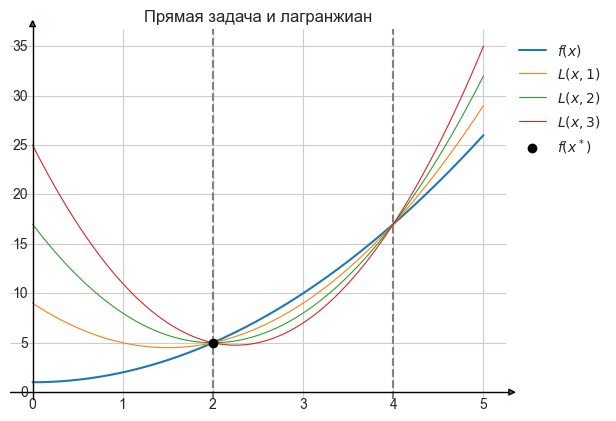
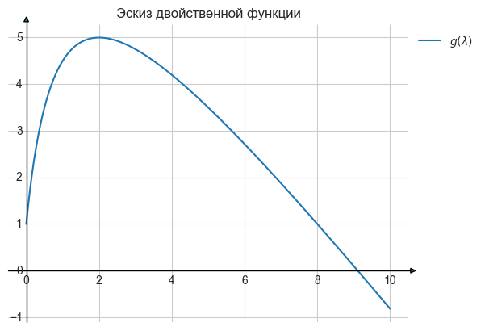

### Задача 1

***Условие***


***Решение***

$$Q(a) = \frac{1}{2}||Ka-y||^2 + \frac{\lambda}{2}a^TKa \rightarrow min$$

$$Q(a) = \frac{1}{2}(Ka-y)^T(Ka-y) + \frac{\lambda}{2}a^TKa \rightarrow min$$

$$Q^{'}_a = \frac{1}{2}(2K^T(Ka-y) + \frac{\lambda}{2}(K+K^T)a$$

$$Q^{'}_a = K^T(Ka-y) + \frac{\lambda}{2}(K+K^T)a = 0$$

Так как $K$ - матрица Грамма, то она симметрична $\rightarrow K=K^T$

$$K(Ka-y)+\lambda Ka = 0$$

$$K^2a-Ky +\lambda Ka = 0$$

$$(K^2 + \lambda K)a = Ky$$

$$K(K + \lambda I)a = K y$$

$$(K+\lambda I)a = y$$

$$a = (K+\lambda I)^{-1}y$$

### Задача 2

***Условие***


***Решение***
1) Допустимое множество:
$$(x-2)(x-4)\leq 0 \rightarrow x \in [2, 4]$$

Так как $f(x)$ на интервале $[2, 4]$ возрастает, то минимум достигается при значении $x^*=2$, $f(x^*) = 5$

2) 
$$L(x, \lambda) = x^2 + 1 + \lambda (x-2)(x-4) = x^2 (1 + \lambda) - 6x \lambda + (8 \lambda + 1)$$ 

$$L^{'}_x = 2x(1+\lambda) -6 \lambda = 0 \rightarrow x = \frac{3\lambda}{1 + \lambda}$$

$$g(\lambda) = (\frac{3\lambda}{1 + \lambda})^2(1+\lambda)-\frac{3\lambda}{1 + \lambda} * (6\lambda) + 8\lambda + 1 = \frac{9\lambda^2}{1 + \lambda} - \frac{18\lambda^2}{1 + \lambda} + 8\lambda + 1 = - \frac{9\lambda^2}{1 + \lambda} + 8\lambda + 1$$

Графики:


```python
from IPython.core.display import HTML
HTML("""
<style>
.output_png {
    display: table-cell;
    text-align: center;
    vertical-align: middle;
}
</style>
""")
```


<style>
.output_png {
    display: table-cell;
    text-align: center;
    vertical-align: middle;
}
</style>


```python
import numpy as np
import matplotlib.pyplot as plt
from mpl_toolkits.axes_grid.axislines import SubplotZero
plt.style.use('seaborn-whitegrid')

fig = plt.figure(1)
ax = SubplotZero(fig, 111)
fig.add_subplot(ax)

for direction in ["xzero", "yzero"]:
    ax.axis[direction].set_axisline_style("-|>")
    ax.axis[direction].set_visible(True)

for direction in ["left", "right", "bottom", "top"]:
    ax.axis[direction].set_visible(False)


grid = np.linspace(0, 5, 1000)

p_lower = 2
p_higher = 4

f_x = lambda x: x ** 2 + 1
x_p = grid[(grid >= p_lower) & (grid <= p_higher)]
x_opt = np.array([2])
L_x_lamb = lambda x, lamb: x ** 2 + 1 + lamb * (x-2) * (x-4)


ax.plot(grid, f_x(grid), label='$f(x)$')
# ax.plot(x_p, f_x(x_p))
ax.axvline(p_lower, ls = '--', c='grey', lw=1.5)
ax.axvline(p_higher, ls = '--', c='grey', lw=1.5)
ax.plot(grid, L_x_lamb(grid, 1), lw=0.8, label='$L(x, 1)$')
ax.plot(grid, L_x_lamb(grid, 2), lw=0.8, label='$L(x, 2)$')
ax.plot(grid, L_x_lamb(grid, 3), lw=0.8, label='$L(x, 3)$')
plt.scatter(x_opt, f_x(x_opt), c='black', zorder=100, label='$f(x^*)$')


plt.title('Прямая задача и лагранжиан')
plt.legend(loc='upper left', bbox_to_anchor=(1, 1))
plt.show()
```


    

    


```python
import numpy as np
import matplotlib.pyplot as plt
from mpl_toolkits.axes_grid.axislines import SubplotZero
plt.style.use('seaborn-whitegrid')

fig = plt.figure(1)
ax = SubplotZero(fig, 111)
fig.add_subplot(ax)

for direction in ["xzero", "yzero"]:
    ax.axis[direction].set_axisline_style("-|>")
    ax.axis[direction].set_visible(True)

for direction in ["left", "right", "bottom", "top"]:
    ax.axis[direction].set_visible(False)


grid = np.linspace(0, 10, 1000)


g_l = lambda l: -9*l**2 / (1 + l) + 8*l + 1


ax.plot(grid, g_l(grid), label='$g(\lambda)$')
# ax.plot(x_p, f_x(x_p))


plt.title('Эскиз двойственной функции')
plt.legend(loc='upper left', bbox_to_anchor=(1, 1))
plt.show()
```


    

    


3) Вообще из эскиза видно, что оптимальное значение $\lambda^*=2$ и двойственное оптимальное значения $g(\lambda^*)=5$, но распишем решение честно.

Двойственная задача:

$$
 \begin{cases}
   g(\lambda) = -\frac{9\lambda^2}{1 + \lambda} + 8\lambda + 1\\
   \lambda \geq 0
 \end{cases}
$$

$$g^{'}_\lambda = -\frac{18\lambda (1+\lambda) - 9\lambda^2}{(1 + \lambda)^2} + 8 = -\frac{9\lambda^2+18\lambda}{(1+\lambda)^2} + 8 = 0$$

$$9\lambda^2+18\lambda = 8(1+\lambda)^2$$

$$9\lambda^2+18\lambda = 8 + 16\lambda + 8\lambda^2$$

$$\lambda^2+2\lambda-8=0$$

$$\lambda_1 = -4, \lambda_2=2\text{ , но по условию $\lambda \geq 0 \rightarrow \lambda^*=2$}$$

$$g(\lambda^*) = 5 = f(x^*) \rightarrow \text{ строгая двойственность выполняется}$$

### Задача 3

***Условие***


***Решение***

$$K(x, z) = cos(x-z) = cos(x)cos(z) + sin(x)sin(z)$$

$$K_1(x, z) = cos(x)cos(z)\text{ - произведение вещественнозначных функций} \rightarrow \text{ядро}$$

$$K_2(x, z) = sin(x)sin(z)\text{ - произведение вещественнозначных функций} \rightarrow \text{ядро}$$

$$K(x, z) = K_1(x, z) + K_2(x, z)\text{ - сумма ядер} \rightarrow \text{ядро}$$

### Задача 4

***Условие***


***Решение***

Рассмотрим произвольные $x, z \in \mathbb {R} $ и посмотрим на определитель

$$
\begin{vmatrix}
  \frac{1}{1 + e^{-x^2}}& \frac{1}{1 + e^{-xz}}\\
  \frac{1}{1 + e^{-xz}}& \frac{1}{1 + e^{-z^2}}\\
\end{vmatrix} = \frac{1}{(1 + e^{-x^2})(1 + e^{-z^2})} - \frac{1}{(1 + e^{-xz})^2}
$$

Определитель меньше нуля, когда $\frac{1}{(1 + e^{-x^2})(1 + e^{-z^2})} < \frac{1}{(1 + e^{-xz})^2}$

Что аналогично $(1 + e^{-x^2})(1 + e^{-z^2}) > (1 + e^{-xz})^2$

Раскроем скобки $1 + e^{-x^2} + e^{-z^2} + e^{-(x^2 + z^2)} > 1 + 2e^{-xz} + e^{-2xz} \rightarrow e^{-x^2} + e^{-z^2} + e^{-(x^2 + z^2)} > 2e^{-xz} + e^{-2xz}$

Если взять $x=1$, то левая часть всегда больше $e^{-x^2}=\frac{1}{e}$

Тогда, чтобы неравенство выполнялось надо подобрать такое $z$, чтобы правая часть была меньше $\frac{1}{e}$

Подставим в правую часть $x=1$, получим

$$2e^{-z} + e^{-2z}<\frac{1}{e}$$

Решив квадратичное уровнение, получим, что $e^{-z} \in (1 - \sqrt{1+\frac{1}{e}}, 1 + \sqrt{1+\frac{1}{e}})$

Следовательно точки подходящие под условия существуют, матрица не положительно определена, следовательно $K(x, z)$ не является ядром

PS: Например в этом интервале лежит $z=0.1$, значение определителя $K(1, 0.1) \approx -0.1$

### Задача 5

***Условие***


***Решение***
$$K_1(x, z) = (1+xz)^2$$
$$K_2(x, z) = (1+xz + x^2z^2)$$

Для $K_1$:

$$K_1(x, z) = (1+xz)^2 = 1 + 2xz + x^2z^2$$

Спрямляющее отображение $\phi(x) = (1, \sqrt{2}x, x^2) \rightarrow$ Спрямляющее пространство $H = (1, x, x^2)$

Для $K_2$:

$$K_2(x, z) = 1+xz + x^2z^2$$

Спрямляющее отображение $\phi(x) = (1, x, x^2) \rightarrow$ Спрямляющее пространство $H = (1, x, x^2)$

Для $K_1 + K_2$:

$$K(x, z) = K_1(x, z) + K_2(x, z) = (1+xz + x^2z^2) + (1 + 2xz + x^2z^2) = 2 + 3xz + 2x^2z^2$$

Спрямляющее отображение $\phi(x) = (\sqrt{2}, \sqrt{3}x, \sqrt{2}x^2) \rightarrow$ Спрямляющее пространство $H = (1, x, x^2)$


```python

```
